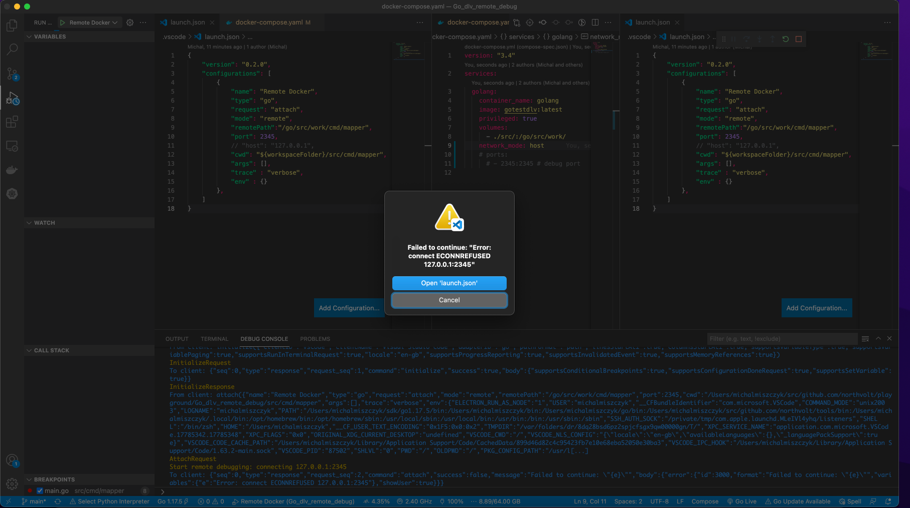

# How to run

1. build image: **docker build -t gotestdlv .**

2. add break point

3. run: **docker-compose up**

4. Attach debugger: From vsCode - use launch.json

# Issue:
When **network_mode: host** specified in docker-compose the following error is thrown when debugging task is started
